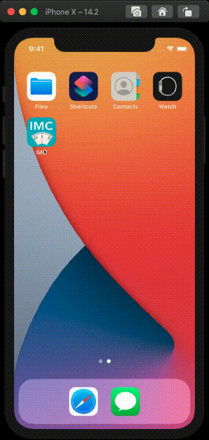

<h1>IMC</h1

Um aplicativo com objetivo de calcular IMC, para iOS
An app who calculate BMI (body mass index).

 
<h3 align="center">Linguagem utilizada.</h3>

  

## Como rodar?
Apenas abra o project no seu xcode e clique no botão de play!

## How run?
Just open the project in xcode and click to play button!
